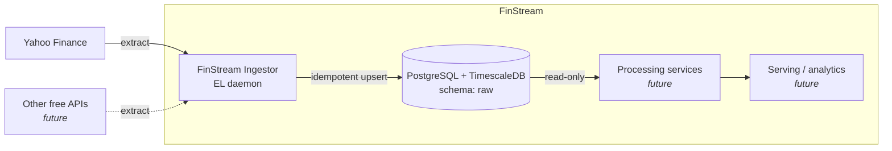

# FinStream

[](https://github.com/KDubicki/FinStream/actions/workflows/ci.yml)

FinStream is a modular data platform for financial market data: gold, ETFs and stock indices. It's built as a set of small, single-purpose microservices around a PostgreSQL + TimescaleDB time-series database.

> **Status:** plan 0001 is in progress — research and the service scaffold (config + logging) are done; the database, source, scheduler and Docker are still to come.
> Short summary: [docs/STATUS.md](docs/STATUS.md).

## Architecture



| Service | Role | Status |
|---|---|---|
| **FinStream Ingestor** (`services/ingestor`) | Extract & Load only. On a schedule, fetches raw OHLCV bars from Yahoo Finance and upserts them into `raw.*` tables. Retries transient failures and never crashes on one. | Planned: [plan 0001](docs/plans/0001-ingestor-implementation.md) |
| Processing services | Transformations, aggregations and indicators, i.e. everything the Ingestor deliberately does **not** do | Future |

Details: [docs/architecture.md](docs/architecture.md) · [docs/data-model.md](docs/data-model.md) · [docs/configuration.md](docs/configuration.md)

## Tech stack

- **Runtime:** Python 3.12 (3.11+ compatible), yfinance, APScheduler 3.x, tenacity, SQLAlchemy 2.0 Core, psycopg 3, pydantic-settings
- **Storage:** PostgreSQL 16 + TimescaleDB
- **Packaging:** Docker, Docker Compose
- **Quality:** ruff, mypy, pytest, testcontainers, pre-commit, gitleaks

## Repository layout

```
.
├── AGENTS.md            # rulebook for AI agents and humans (read first)
├── CLAUDE.md            # Claude Code entry point (imports AGENTS.md)
├── .agents/skills/      # research / development / test skills (canonical)
├── .claude/             # Claude Code settings + hooks; skills -> ../.agents/skills
├── .pre-commit-config.yaml
├── docs/                # architecture, methodology, data model, configuration, ADRs, plans, research
└── services/ingestor/   # created by plan 0001
```

## Quickstart

> Available once plan 0001 is implemented.

```bash
cp .env.example .env              # then set POSTGRES_PASSWORD and review the other values
docker compose up -d --build
docker compose logs -f ingestor
```

## Development setup

```bash
brew install pre-commit           # or: pipx install pre-commit
pre-commit install --hook-type pre-commit --hook-type commit-msg
pre-commit run --all-files
```

## How we work

Every change follows **Research → Plan → Implement → Test → Review & Document**. Plans are approved before any code is written. Twelve numbered golden rules apply, and a change isn't done until it meets the Definition of Done. Claude Code hooks and pre-commit enforce the rules locally, and CI re-runs the same gates on every push, so they aren't only documented.

- [AGENTS.md](AGENTS.md): the rulebook
- [docs/methodology.md](docs/methodology.md): full workflow and the rationale behind each rule
- [docs/README.md](docs/README.md): documentation index
