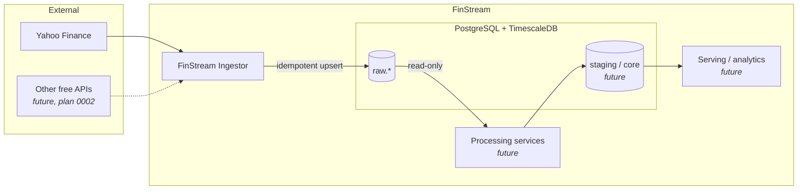
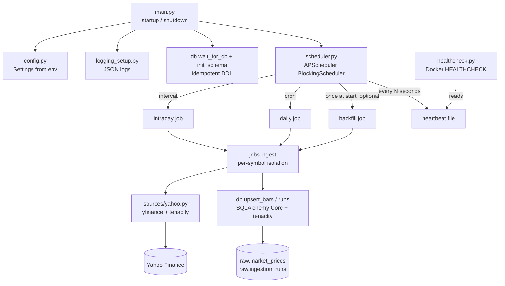
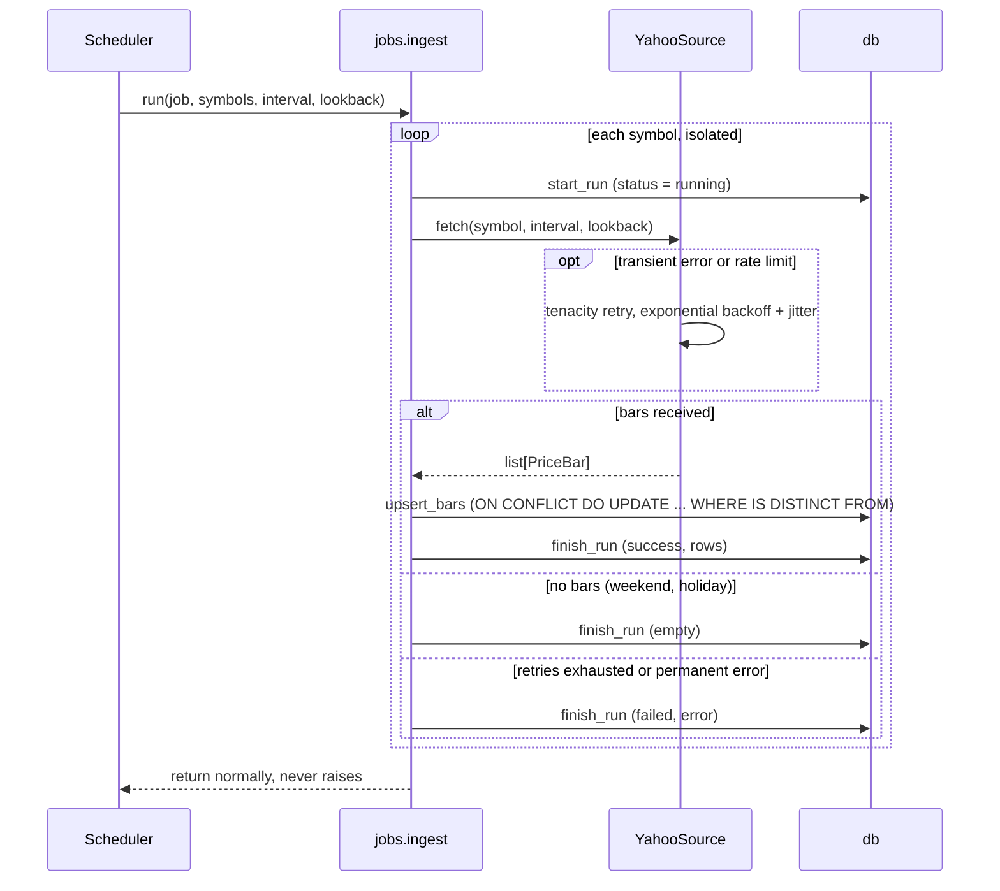

# Architecture

> **Status: design.** The Ingestor described here is implemented by [plan 0001](plans/0001-ingestor-implementation.md). If the implementation diverges, update this document in the same change (GR-11).

## 1. Platform overview

FinStream is a set of small, single-purpose services around one PostgreSQL + TimescaleDB database. Data flows through layers, and every layer has exactly one owner.

| Layer | Schema | Owner | Responsibility |
|---|---|---|---|
| Ingest (raw) | `raw` | FinStream Ingestor | Land source data as received: typed, UTC, deduplicated by natural key |
| Process | `staging`, `core` *(future)* | Processing services *(future)* | Cleaning, trading calendars, adjustments, resampling, aggregations, indicators |
| Serve | reads `raw` for now | **FinStream Dashboard** (`services/dashboard`) | Streamlit UI: prices, coverage, ingestion health. Read-only ([ADR-0005](adr/0005-serving-reads-raw-directly.md)) |

A layer only **reads** from the layer before it. The `raw` schema is the contract between the Ingestor and everything downstream, so changes to it follow GR-6 ([data-model.md](data-model.md)).

## 2. FinStream Ingestor

A long-running Python daemon in a single container. It does **Extract & Load only** ([ADR-0001](adr/0001-ingestor-is-extract-load-only.md)), schedules with APScheduler and retries with tenacity ([ADR-0003](adr/0003-apscheduler-and-tenacity.md)).

### 2.1 Components

| Module | Responsibility | Must not |
|---|---|---|
| `config.py` | Load and validate all settings from the environment (pydantic-settings) | Hold import-time global state |
| `sources/base.py` | `PriceBar`, `PriceSource` protocol, error types (`TransientSourceError`, `RateLimitedError`, `PermanentSourceError`) | — |
| `sources/yahoo.py` | Call yfinance, classify errors, retry transient ones, normalise minimally → `list[PriceBar]` | Import `db`; transform data (GR-1) |
| `schema.py`, `db.py` | Engine, wait-for-DB, idempotent DDL, upserts, run records | Call external APIs |
| `jobs.py` | For each symbol: start run → fetch → upsert → finish run | Let an exception escape (GR-3) |
| `scheduler.py` | Register jobs, triggers and listeners; heartbeat | Contain business logic |
| `main.py` | Wiring; SIGTERM/SIGINT → graceful shutdown | — |
| `healthcheck.py` | Exit 0 if the heartbeat file is fresh | — |

### 2.2 One job run

### 2.3 The EL boundary

| Allowed in the Ingestor | Forbidden (belongs downstream) |
|---|---|
| Renaming columns (`Adj Close` → `adj_close`) | Resampling (e.g. 1h → 1d), aggregations |
| Casting types, `NaN` → `NULL` | Gap filling, forward-fill, interpolation |
| Converting timestamps to UTC | Returns, indicators, spreads, ratios |
| Dropping rows where every value is `NaN` | Currency or unit conversion |
| Bookkeeping columns (`source`, `ingested_at`, `updated_at`) | Cross-source deduplication, outlier "fixes" |

### 2.4 Scheduling model

- **Intraday:** every `INTRADAY_EVERY_MINUTES`, fetch `INTRADAY_INTERVAL` bars for the last `INTRADAY_LOOKBACK`.
- **Daily:** on `DAILY_CRON` in `SCHEDULER_TIMEZONE` (by default after the US market close), fetch `1d` bars for the last `DAILY_LOOKBACK`.
- **Backfill (optional):** once at startup, fetch `1d` bars for `BACKFILL_PERIOD`.
- **Lookback windows deliberately overlap previous runs.** Missed runs (downtime, failures) heal automatically, and revised bars (the still-forming latest bar, adjusted closes) get updated. Idempotent upserts (GR-2) make the overlap safe.
- **Job defaults:** `max_instances=1` (a job never overlaps itself), `coalesce=True` (a backlog of missed runs collapses into one run), `misfire_grace_time = SCHEDULER_MISFIRE_GRACE_SECONDS`. Every job also runs once at startup.

All values are configured through the environment, see [configuration.md](configuration.md).

### 2.5 Failure modes

| Failure | Behaviour | Recovery |
|---|---|---|
| Yahoo timeout / 5xx / network error | Classified transient; retried with exponential backoff + jitter (`RETRY_*`) | Retries exhausted → run `failed`; the next scheduled run tries again and its lookback fills the gap |
| Yahoo rate limiting | Classified `RateLimitedError`; retried with backoff | As above |
| Invalid or delisted symbol | Classified permanent, **not** retried (classification verified in plan 0001 R1) | Run `failed` with the error; other symbols unaffected; fix `YAHOO_SYMBOLS` |
| No data (weekend, holiday) | Run `empty`, logged at WARNING | None needed |
| Unexpected exception for one symbol | Caught at the job boundary, logged with traceback | Run `failed`; remaining symbols continue (GR-3) |
| DB unreachable at startup | `wait_for_db` retries | Still down → exit non-zero → Compose `restart: unless-stopped` |
| DB error during a write | `OperationalError` retried | Exhausted → run `failed`; the next run re-upserts idempotently |
| Job runs longer than its interval | `max_instances=1` skips the overlapping start; `coalesce` | Next trigger proceeds normally |
| Container stopped (SIGTERM) | Scheduler shuts down; an in-flight upsert transaction either commits or rolls back atomically | Re-running after restart is safe (GR-2) |
| Process hangs | Heartbeat goes stale → `HEALTHCHECK` reports unhealthy | Visible in `docker compose ps`; restart |
| Yahoo API change / yfinance breaks | Persistent `failed` runs in `raw.ingestion_runs` | Upgrade via research → plan; alternative sources (plan 0002) |

`raw.ingestion_runs` is the operational record. Operators and downstream services can see exactly which symbol and interval failed, when, and why.

## 3. Deployment

- **Compose** (repo root) runs three services:
  - `db`: TimescaleDB image with a pinned tag, a named volume, and a `pg_isready` healthcheck.
  - `ingestor`: built from `services/ingestor`, with `env_file: .env`, `depends_on: db (service_healthy)`, `restart: unless-stopped` and `init: true`. Runs as a non-root user, with a `HEALTHCHECK` that reads the scheduler's heartbeat file.
  - `dashboard`: built from `services/dashboard`, read-only Streamlit UI published on `127.0.0.1:${DASHBOARD_PORT}` ([ADR-0005](adr/0005-serving-reads-raw-directly.md)).
- **Network exposure:** the DB port is published on `127.0.0.1` only.
- **Configuration:** the image contains no secrets. All configuration arrives through the environment at runtime.

## 4. Future evolution (not planned yet)

- Additional sources behind the `PriceSource` protocol (plan 0002).
- CI pipeline (pre-commit, tests, image build).
- Alembic migrations once the schema needs a non-additive change.
- Metrics endpoint and alerting on consecutive failed runs; TimescaleDB compression/retention policies.
