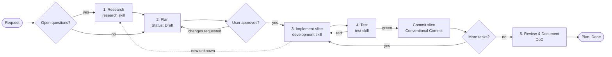

# Methodology

How work is done in FinStream, and why. [AGENTS.md](../AGENTS.md) holds the short, binding version. This document explains the reasoning, the gates and the enforcement. Changing the methodology requires a new ADR that supersedes [ADR-0004](adr/0004-agent-methodology-and-enforcement.md).

## 1. Principles

1. **Plan before code.** Non-trivial work starts from a written plan that the user has approved. Plans are cheap to change and code isn't.
2. **Evidence over assertion.** Facts about libraries come from current primary sources. Claims that something works come from real command output.
3. **Small, verified, committed slices.** Each slice is tested and committed as a Conventional Commit at a meaningful unit of work, which keeps the history reviewable and easy to revert.
4. **Docs are part of the change.** A change without its documentation isn't finished.
5. **Layered enforcement.** Rules are written down (AGENTS.md), taught step by step (skills), and checked by tooling (Claude Code hooks, pre-commit). A rule that only lives in prose eventually gets broken.
6. **One rulebook, many agents.** Every tool reads the same `AGENTS.md` and the same skills. Nothing is duplicated per tool.

## 2. Lifecycle



Plan statuses: `Draft` → `Approved` (only the user sets this) → `In progress` → `Done`, or `Abandoned`.

## 3. Phases

| Phase | Entry criteria | Activities | Exit criteria / gate | Artefacts |
|---|---|---|---|---|
| **1. Research** | An open question about a library, API, version or approach | Consult primary sources; optional spike outside the repo | Every finding cited and versioned; explicit recommendation | `docs/research/YYYY-MM-DD-<topic>.md`, draft ADR |
| **2. Plan** | The problem is understood | Fill in the [plan template](plans/TEMPLATE.md): context, goals, non-goals, design, tasks, test plan, risks | **User approval** (`Status: Approved`) | `docs/plans/NNNN-<slug>.md` |
| **3. Implement** | An `Approved` / `In progress` plan exists; blocking research is resolved | Smallest slice; tests with or before code; docs updated alongside | The slice's tests are written and pass locally | Code, tests, docs |
| **4. Test** | A slice is implemented | Lint → types → unit → integration (→ smoke) | Gate green; real output in the plan's Verification log; **slice committed** | Verification log entry, commit |
| **5. Review & Document** | All plan tasks are ticked | Golden-rules review of the full diff; full gate; DoD; docs match reality | Every DoD item ticked or `n/a` with a reason | Plan `Done`, final commit |

Phases can loop. If implementation uncovers a new unknown, go back to Research. If research invalidates the design, update the plan and get it approved again.

## 4. When a plan is required

| Change | Plan required? |
|---|---|
| Typo, wording, broken link, documentation-only clarification | No |
| Change confined to one source file with no behaviour change (e.g. rename a local variable) | No, but a Conventional Commit is still required |
| More than one source file | **Yes** |
| DB schema (tables, columns, indexes, hypertables) | **Yes**, plus a data-model.md update (GR-6) |
| Configuration (new/changed env var) | **Yes**, plus `.env.example` + configuration.md (GR-4) |
| Dependencies (add, remove, upgrade) | **Yes**, plus a research note (GR-8) |
| Dockerfile / Compose | **Yes** |
| Externally visible behaviour (schedules, data written, logs others rely on) | **Yes** |
| Methodology or rulebook | **Yes**, plus a new ADR superseding ADR-0004 |

## 5. Golden rules: rationale and enforcement

| Rule | Why it exists | Enforced by |
|---|---|---|
| **GR-1** EL only | Raw data stays replayable; downstream services own business logic; the Ingestor stays small and stable ([ADR-0001](adr/0001-ingestor-is-extract-load-only.md)) | EL-boundary test (test skill), golden-rules review, module boundaries |
| **GR-2** Idempotent writes | Schedules overlap on purpose, containers restart, jobs are retried. Duplicates would corrupt every downstream calculation | Primary key in DB, `ON CONFLICT` upserts, idempotency + revision tests |
| **GR-3** Daemon never dies | Free APIs fail routinely; one bad symbol must not starve the others; the service runs unattended | Retry, exhaustion and resilience tests; `raw.ingestion_runs`; Compose `restart`; healthcheck |
| **GR-4** Config from env | One image runs everywhere (12-factor); no redeploy to change tickers | pydantic-settings fail-fast validation; DoD check `.env.example` ↔ configuration.md |
| **GR-5** Secrets | A leaked credential can't be un-leaked | `.gitignore`; file & Bash guard hooks; `permissions.deny`; gitleaks; detect-private-key; `forbid-env-files` hook |
| **GR-6** Schema | Data outlives deployments; no manual DB surgery | Idempotent DDL at startup; re-entrancy test; ADR requirement for breaking changes |
| **GR-7** Tests | Deterministic runs; `ON CONFLICT` and hypertable semantics can't be faithfully mocked | Test skill; no-network fixture; testcontainers; coverage gate ≥ 85% |
| **GR-8** Dependencies | Reproducible builds; smaller supply-chain surface | Exact pins; research note; review |
| **GR-9** Verify, don't assume | Model memory is stale; yfinance and friends change often | Research skill; Verification log; SessionStart reminder |
| **GR-10** Scope discipline | Reviewable diffs; no surprise changes | Plan gate; Follow-ups section; golden-rules review |
| **GR-11** Docs move with code | Documentation rots unless it's part of the change | DoD checklist; Review & Document phase |
| **GR-12** Git hygiene | Readable, revertable history; hooks are the last line of defence | `conventional-pre-commit` (commit-msg); Bash guard hook (no `--no-verify`, force-push, `reset --hard`, `down -v`) |

## 6. Definition of Done

The checklist lives in [AGENTS.md §6](../AGENTS.md#6-definition-of-done) and in every plan. An item that doesn't apply is marked `n/a` with a reason. Items are never silently dropped.

## 7. Artefact conventions

| Artefact | Location & name | Lifecycle | Notes |
|---|---|---|---|
| Plan | `docs/plans/NNNN-<slug>.md` | Draft → Approved → In progress → Done / Abandoned | Tasks are ticked as slices land. Verification log and Change log are append-only |
| ADR | `docs/adr/NNNN-<slug>.md` | Proposed → Accepted → Superseded by ADR-NNNN / Deprecated | Accepted ADRs are immutable; only a one-line status change is allowed (hook-enforced) |
| Research note | `docs/research/YYYY-MM-DD-<topic>.md` | Draft → Final | Findings carry source + version + date |
| Commit | Git history | — | Conventional Commits, one logical change per commit, committed once that slice is verified |

Indexes of ADRs and plans are kept in [docs/README.md](README.md).

### Commit policy

- **Every commit** follows [Conventional Commits](https://www.conventionalcommits.org/): `<type>(<scope>): <subject>`.
  - Types: `feat`, `fix`, `docs`, `test`, `refactor`, `perf`, `style`, `build`, `ci`, `chore`, `revert`.
  - Subject: imperative, lower-case, no trailing period, ≤ 72 characters.
  - Breaking changes: `!` or a `BREAKING CHANGE:` footer.
- **Commit at meaningful units.** A commit is one complete, verified slice, typically a milestone, together with its tests and doc/plan updates. Don't let work pile up uncommitted, don't commit red or unverified work, and don't spend a commit on a trivial edit such as a status bump.
- **Stage only the slice's files.** Never use `git add -A` blindly.
- **Branches:** work lands on `main` by default in this single-maintainer repository. Use `feat/NNNN-<slug>` when a change should be reviewed or proved by CI before landing. Pushed history is never rewritten.

## 8. Enforcement layers

| Layer | Applies to | What it catches | Limits |
|---|---|---|---|
| [AGENTS.md](../AGENTS.md) | Every agent and human | Everything, as written policy | Relies on being read and followed |
| Skills (`.agents/skills/`) | Agents that support skills | Procedural drift: skipped steps, missing tests, undocumented changes | Guidance, not a hard check |
| Claude Code hooks (`.claude/`) | Claude Code sessions | `.env`/key access, Accepted-ADR edits, hook bypass, force-push, destructive git/docker/rm; ruff on every edited `.py`; rule reminder on session start | Heuristic command inspection; defence in depth, not a sandbox |
| pre-commit (`.pre-commit-config.yaml`) | Every commit from any tool or human (once installed) | Formatting, lint, types, secrets (gitleaks, private keys, `.env`), broken symlinks, non-conventional commit messages | Local only; can be skipped by someone deliberately bypassing it, which GR-12 forbids |
| CI (`.github/workflows/`) | Every push to `main` and every pull request | The same gates on a clean machine: pre-commit (ruff, mypy, gitleaks), unit tests on Python 3.11 and 3.12, TimescaleDB integration tests, the coverage gate, Conventional Commit subjects, and the image build once a Dockerfile exists. A weekly workflow runs `pip-audit` and a full-history secret scan | Cannot catch what no gate encodes; a red run still needs someone to read it ([plan 0002](plans/0002-ci-pipeline.md)) |

**Installing the local layers:**

```bash
brew install pre-commit      # or: pipx install pre-commit
pre-commit install --hook-type pre-commit --hook-type commit-msg
```

Claude Code picks up `.claude/settings.json` automatically. Review hook changes in the `/hooks` menu.

## 9. Precedence and exceptions

**Explicit user instruction > AGENTS.md golden rules > skill instructions > plan details.**

When a user instruction conflicts with a golden rule, the agent names the rule, states the risk, and asks for confirmation. A confirmed exception is recorded in the active plan (`## Exceptions`: rule, reason, date, who approved). Exceptions apply to that change only. They never silently become the new rule. Changing a rule permanently means updating AGENTS.md through a plan and an ADR.

## 10. Multi-agent setup

| Tool | Reads rules from | Skills |
|---|---|---|
| Claude Code | `CLAUDE.md` → `@AGENTS.md` | `.claude/skills` → symlink to `.agents/skills` |
| Codex, Cursor, other AGENTS.md-aware tools | `AGENTS.md` | `.agents/skills` (or read the `SKILL.md` files directly) |
| Humans | `README.md` → `AGENTS.md` | Same files, as runbooks |

- **Adding a skill:** create `.agents/skills/<name>/SKILL.md` with `name` and `description` frontmatter. The symlink exposes it to Claude Code automatically.
- **Tool-specific files** may only add tool mechanics (e.g. hooks). They never add or change rules.
- **Windows checkouts** need `git config core.symlinks true` (plus Developer Mode) for `.claude/skills` to work.
